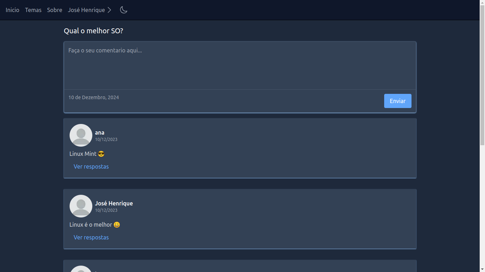

# DiversityForum



> Apresentamos o DiversityForum, um fórum online vibrante e dinâmico 
  onde você pode se conectar com pessoas que compartilham seus interesses. 
  Crie tópicos, participe de conversas e explore um mundo de conhecimento 
  e ideias!


## 💻 Pré-requisitos

Antes de começar, verifique se você atendeu aos seguintes requisitos:

* Você possui instalado o `Node.js`
* Você possui a api do forum instalada, caso não tenha, clone esse [repósitorio](https://github.com/JoseHenrique1/ForumApi) e siga o processo de instalação.


## 🚀 Instalando DiversityForum

Para instalar o DiversityForum, siga estas etapas:

```
npm i
```

Configure suas variáveis de ambiente:
```
NEXTAUTH_URL=(url que está rodando o front-end)
NEXTAUTH_SECRET=(chave do next auth, pode ser qualquer coisa)
NEXT_PUBLIC_API_URL=(url da API)
NEXT_PUBLIC_SOCKET_URL=(url da API com ws, ex: ws://localhost:3000 )
```

## ☕ Usando DiversityForum

Para usar DiversityForum, inicie a api antes de iniciar o front-end:

API
```
npm run dev
```

Front-end
```
npm run dev
```


## 🤝 Colaboradores

<table>
  <tr>
    <td align="center">
      <a href="https://github.com/JoseHenrique1">
        <br>
        <sub>
          <b>José Henrique</b>
        </sub>
      </a>
    </td>
  </tr>
</table>


